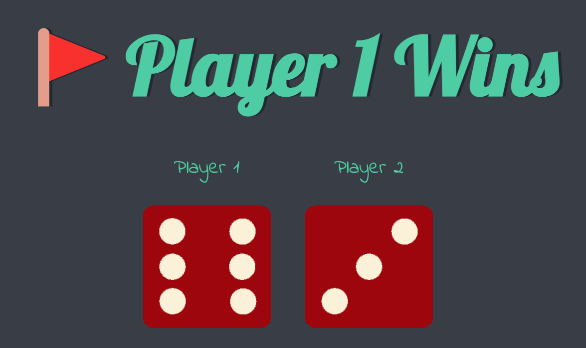
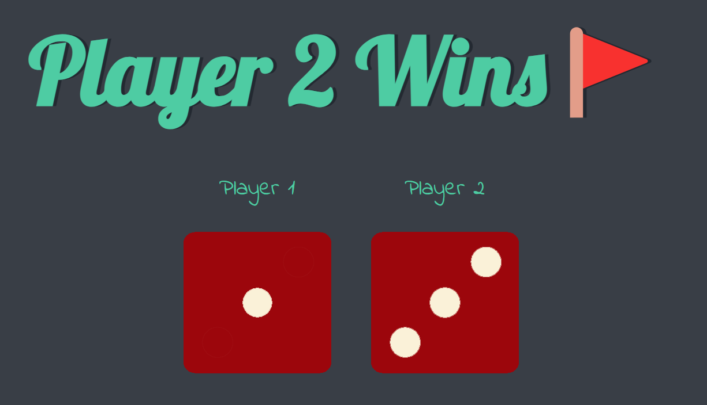
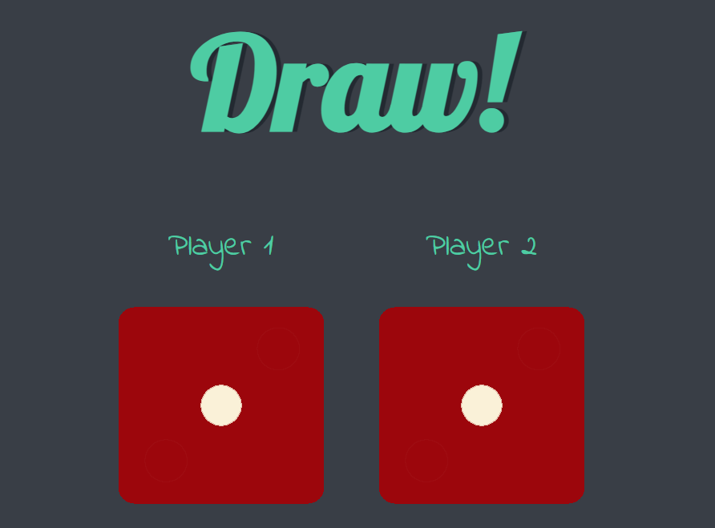

## Dice Game

- A game between two players, the player who gets greater dice number wins, otherwise draw.
- Tech Stack- HTML and CSS.
- <a href="https://akshit1903.github.io/DiceGame/">Deployed Link</a>

